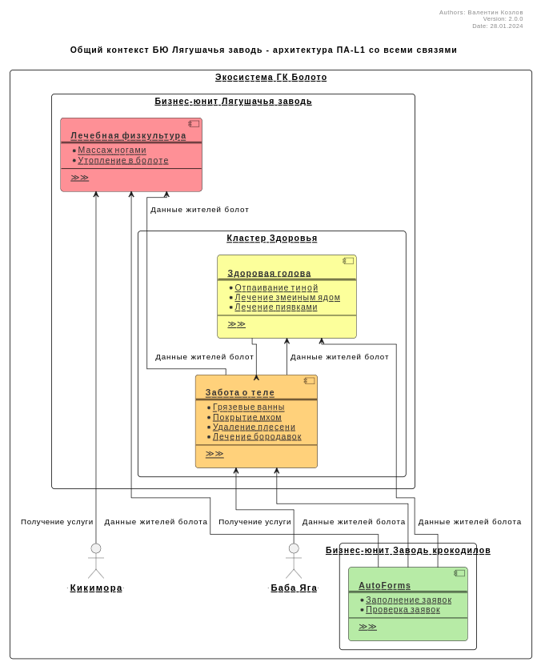
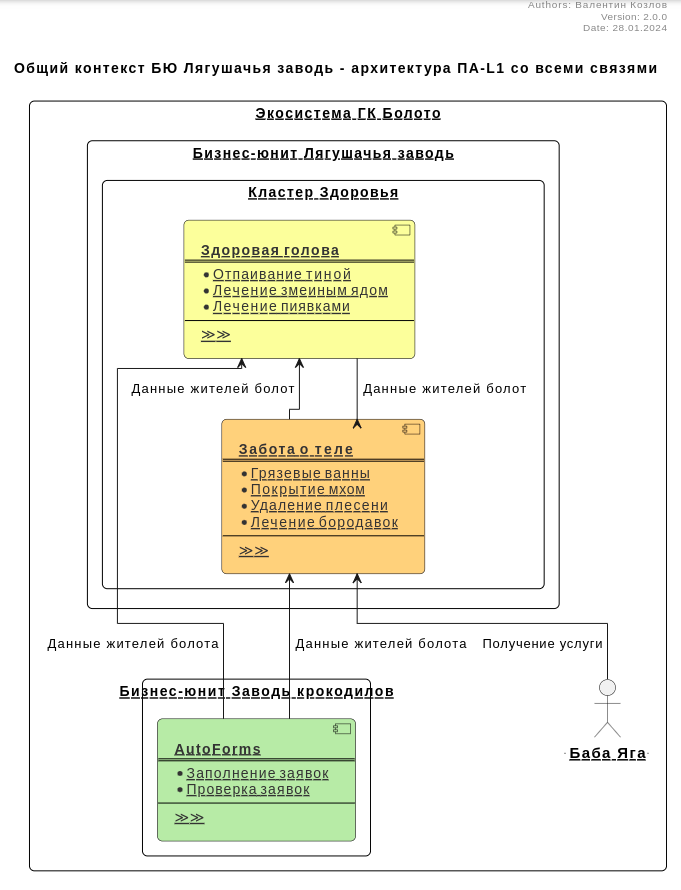

# Пример озер данных (manifest)

**Цели примера:**
1. Снизить порог вхождения в DocHub за счет исследования полнофункционального работающего примера.
2. Показать пример структуры репозитория с данными
3. Показать примеры расширения дефолтной метамодели


# Суть примера
Существует множество различных подходов к описанию архитектуры компании. В нашей компании была выбрана методология TOGAF. При этом мы не пытаемся внедрить классическую методологию TOGAF, мы используем комбинированный подход, выбирая только те инструменты, которые закрывают наиболее критичные риски компании.

Согласно методологии TOGAF архитектура предприятия делится на 4 домена:

1. Бизнес-архитектура - описание бизнес-процессов компании
2. Информационная архитектура - описание архитектуры данных
3. Прикладная архитектура - описание архитектуры программных продуктов (системы, сервисы, приложения и т.д.)
4. Технологическая архитектура - описание архитектуры инфраструктуры


Вся структура примера разработана под выбранную методологию с учетом нашего видения. В общем случае в данном репозитории мы ведем прикладную архитектур ровня ПА-L1, но если у системы нет своего репозитория, либо у архитектора несколько систем, то он может управлять в этом репозитории и уровнем ПА-L2.

## Какой функционал можно найти в примере

В примере описывается, уже многим известное ГК Болото и жизнь её обитателей. Там же вы сможете найти примеры реализации следующих фич:
1.  Пример доработки дефолтной метамодели:
    *  Реализован алгоритм подкрашивания систем в зависимости от её рейтинга
    *  Примеры расширения карточки системы пользовательскими виджитами, включая управление документацией системы и ответственными сотрудниками по системе.
2.  Примеры реализаций кастомных сущностей - бизнес-сущности, управление средами развертывания, справочники, управление структурой меню, управление библиотеками и т.д.
3.  Примеры структуры репозиториев с данным и метамоделью
4.  Примеры описания функциональности систем через аспекты
5.  Примеры различных отчетов
6.  Примеры управления документацией – есть пример описания процесса управления библиотеками, пример инструкции по управлению библиотеками, пример заполнения данных DocHub (пока устаревший, но основные принципы корректны, а также многое другой)
7.  Примеры использования datasets и функций
8. Пример группировки по тактическим юнитам

## Файловая структура примера
* **swamp**
    * **adr** - в этой папке хранится реестр архитектурных решений
    * **application_arch** - в этой папке хранятся все данные, связанные с прикладной архитектурой, кроме контекстов. Контексты мы вынесли в отдельную папку artifacts. Детально про artifacts можно почитать ниже.
        * **aspects** - в этой папке хранятся аспекты. В примере аспекты используются в качестве функционала системы.
        * **libraries** - в этой папке хранятся библиотеки компании.
        * **reports** - в этой папке хранятся различные отчеты по системам.
        * **systems** - в этой папке хранятся данные по системам. Каждую систему мы описываем либо в своём файле либо в отдельной папке в случае если по системе нужна дополнительная документация. Имя файла или папки всегда соответствует имени системы. Документацию описанию прикладной архитектуры вы сможете найти в самом примере: http://localhost:8080/entities/docs/blank?dh-doc-id=enterprise_arch.arch_desc_guide.    
        * **users** - в этой папке хранится список пользователей системы.
    * **artifacts** - в этой папке хранятся все артефакты по системам, например контексты. Также здесь можно хранить различные схемы по системам.
        * **common** - в этой папке хранится общий контекст ГК Болото.
        * **bu_<имя бизнес-юнита>** - в этой папке хранится контекст БЮ Лягушачий рай.
    * **business_arch** - в этой папке хранятся все данные, связанные с бизнес-архитектурой.
        * **tactical_units** - в этой папке хранятся тактические юниты компании по которым нужна группировка систем
    * **dictionaries** - вспомогательная папка для хранения справочной информации. Кастомная сущность описанная в [репозитории](https://github.com/ValentinKozlov/DocHubExampleMetamodel).
    * **documentation** - в этой папке хранится общая документация.
        * **glossary** - в этой папке хранится глоссарий ГК Болото.
        * **intro** - в этой папке хранится информация о том, что такое архитектура ГК Болото.
        * **useful_links** - в этой папке хранятся полезные линки на внешние ресурсы.    
    * **enterprise_arch** - это папка корпоративных архитекторов, сюда можно поместить всю информацию, которая связана с развитием архитектуры в компании.    
        * **processes** - в этой папке хранится документация по различным архитектурным процессам
        * **tools** - в этой папке хранится документация по инструментам архитектуры
            * **dochub** - в этой папке хранится документация и различные инструменты по DocHub
        * **welcome** - в этой папке хранится документация, которая выводится при открытии DocHub (welcome page) 
    * **images** - картинки для настоящей документации
    * **information_arch** - в этой папке хранятся все данные, связанные с информационной архитектурой.
        * **business_entities** - в этой папке хранятся данные по бизнес-сущностям. Кастомная сущность описанная в [репозитории](https://github.com/ValentinKozlov/DocHubExampleMetamodel).
    * **standards** - это одна из ключевых папок, где хранятся архитектурные принципы и стандарты, которые обязательны к выполнению всеми командами
        * **arch_principles** - здесь описаны архитектурные принципы и принципы информационной безопасности
        * **it_platforms** - здесь хранятся архитектурные стандарты по платформам, а также принятые нотации по кодированию
        * **patterns** - здесь описываются различные паттерны, которые могут использовать команды. В репозитории есть пример реализации одного из таких паттернов.
    * **tech_arch** - в этой папке хранятся все данные, связанные с технологической архитектурой. 
        * **environments** - в этой папке хранятся данные по средам развертывания. Кастомная сущность описанная в [репозитории](https://github.com/ValentinKozlov/DocHubExampleMetamodel).
        * **reports** - в этой папке хранятся отчеты по технической архитектуре
    * **dochub_menu.yaml** - файл со структурой меню. После того как Рома сделал возможность сортировать меню, то можно структуру меню сделать сразу при загрузке, а потом потихоньку его наполнять. Кастомная сущность описанная в [репозитории](https://github.com/ValentinKozlov/DocHubExampleMetamodel).
* **_root.yaml** - корневой файл для импорта
* **dochub.yaml** - корневой файл DocHub. Для того чтобы заработало в плагине, нужно извратиться и подключить кастомную метамодель.
* **README.md** - текущая документация

## Правила импорта yaml файлов
Импорт всех файлов делается только через `_root.yaml`. Это означает что при создании любой папки всегда нужно сначала добавлять `_root.yaml`, а уже внутри подключать файлы. Исключения составляет только подход с описанием систем.
Такой подход позволяет очень быстро переструктурировать папки репозитория, а также избегать множественного импорта при подключении репозитория как подмодуль.

## Использование
Самый простой способ запустить озеро данных - это воспользоваться репозиторием https://github.com/cu3blukekc/SwampHub.
Остальные способы вариативны и зависят от глубины понимания вами принципов работы DocHub.

### Тактические юниты

В дефолтной метамоделе в качестве иерархии компании используется сущность components. С одной стороны это позволяет достаточно просто строить группировки в контекстах, с другой стороны структура организации это отдельная сущность которой хочется управлять отдельно от систем и их компонент. Для решения это проблемы была создана новая сущность **Тактические юниты**.

Под тактическими юнитам (*tactical_units*) понимается неформальная организационная структура компании в рамках которой происходит реальное управление командами разработки.

На момент формирования модели предполагается, что есть несколько связанных организационных типов (type):
1. *пусто* - Компания или группа компаний
2. *bu* - Бизнес-юнит (БЮ)
3. *block* - Блок
4. *cluster* - Кластер

Пример можно найти [здесь](./swamp/business_arch/tactical_units/tactical_units_swamp.yaml).

Модель спроектирована таким образом, что тактические юниты можно изменять включая их подчинение, это позволяет с минимальными затратами вносить изменения в модель.

Последний элемент в иерархии является группировкой для систем и если требуется сгруппировать системы в разрезе этого элемента, то необходимо указать его идентификатор в значение реквизита системы *tactical_unit:*. 

Также *tactical_unit* можно использовать для оптимизации процесса ввода следующих реквизитов системы:
* business_owners
* application_owner
* architect
* budget_holder
* business_areas

Пример можно найти [здесь](./swamp/application_arch/systems/bu_frogs/healthy_body.yaml).

Одним из ключевых предназначений сущности является возможность группировать системы по тактическим юнитам. Для того чтобы это сделать нужно выполнить следующий набор шагов:
1. Нужно [описать тактический юнит по которому планируется сделать группировку](./swamp/business_arch/tactical_units/tactical_units_health.yaml)
2. Нужно добавить созданный тактический юнит во все [системы](./swamp/application_arch/systems/bu_frogs/healthy_body.yaml), которые входят в этот юнит (`tactical_unit: health`)
3. В контексте нужно указать, что требуется дополнительная группировка `add-group: true`. При этом есть два способа вывода:
    * Стандартный использую раздел components:
        ```
        bu_hippos.tactical_units:
          title: Общий контекст БЮ Лягушачья заводь - архитектура ПА-L1 со всеми связями
          location: Прикладной ландшафт ПА-L1/БЮ Лягушачья заводь/С группировкой по тактическим юнитам
          extra-links: true
          add-group: true
          uml:      
            $autor: Валентин Козлов
            $version: 2.0.0
            $moment: 28.01.2024
          components:
            - swamp.bu_frogs.*
        ```
    

    * Доработанный через запрос
        ```
        bu_hippos.specific_tactical_unit:
          title: Общий контекст БЮ Лягушачья заводь - архитектура ПА-L1 со всеми связями
          location: Прикладной ландшафт ПА-L1/БЮ Лягушачья заводь/Отбор по конкретному тактическому юниту
          extra-links: true
          add-group: true
          uml:      
            $autor: Валентин Козлов
            $version: 2.0.0
            $moment: 28.01.2024
          components:      
            - "**"
          # Запрос пока не учитывает extra-links из контекста, поэтому приходиться насильно втыкать этот флаг 'isExtraLinks': true
          source: >  # выбираем все системы по tactical_unit, можно передавать более одного значения 'tactical_unit': ['health','other']
            (
              $eval($.functions.get_systems_for_context, {'manifest': $, 'isExtraLinks': true, 'tactical_unit': ['health']});
            )
    

## Авторские права
1. Данный репозиторий с примерами был выполнен Валентином Козловым https://t.me/i_frog_i.
2. В пример были включены наработки Романа Пионтика и участников сообщества, а именно:
    * Максима Муратова
    * Если кого-то забыл, прошу написать, я добавлю

В дальнейшем планируется собрать на базе этого репозитория все интересные наработки сообщества опубликованные [здесь](https://github.com/rpiontik/DocHubExamples).
