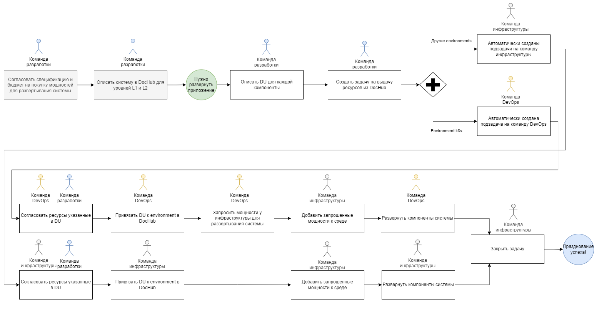
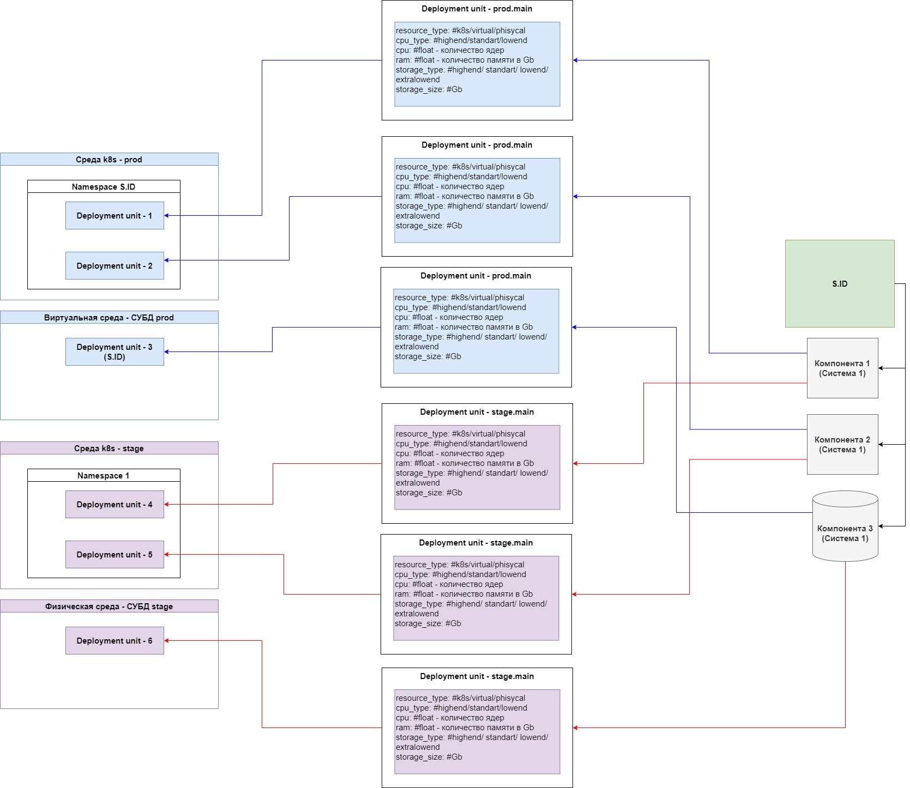
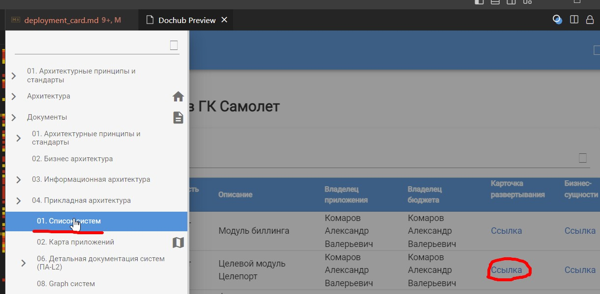
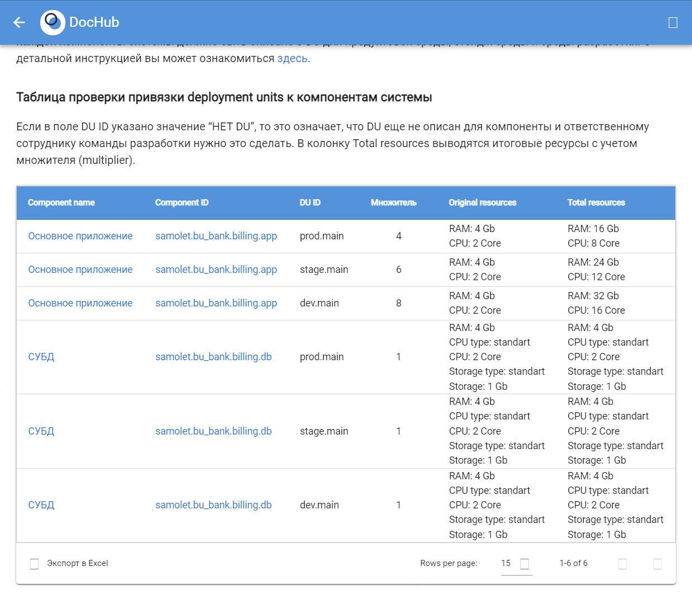

# Процесс развертывания систем в ГК Самолёт

## Список используемых терминов


**Среда** или **Environment** - данное понятие было введено для возможности логической группировки систем в компании на базе различных технологий. Например, среда может быть кластером Kubernetes, виртуальной машиной на базе VMWare, физическим сервером или группой физических серверов на которых расположена одна или несколько систем. Данный термин был введен с целью унификации модели управления системами на базе DocHub.

**Deployment units (DU)** - единицы развертывания системы. Детали можно можно узнать в разделе ["Общее описание подхода"](#du).


## Ограничения старта процесса

Старт процесса может начинаться только если устранены описанные ниже ограничения:

1. Если Команде разработки, требуются ресурсы инфраструктуры для развертывания новой системы или расширение текущей, то у команды должен быть согласованный бюджет на их покупку.

2. Заявка на покупку оборудования должна быть подана не менее чем за 4 месяца до начал развертывания системы в команду инфраструктуры. Если есть резервные ресурсы, то они могут быть выданы сразу, но параллельно должен быть запущен процесс приобретения ресурсов.

3. Ресурсы могут выдаваться только для тех систем, которые уже были описаны в DocHub в соответствии с [инструкцией](/docs/dochub.arch_desc_guide).

## Предпосылки появления процесса

В компании есть несколько [видов сред](#environment). При этом среды могут делиться по целям, например, Продуктовые среды, Стейдж-среды, Среды разработки.

В компании есть более 300 систем (уровень L1) каждая из которых состоит из своих run-time компонент (уровень L2). Для того чтобы запустить систему в работу необходимо разместить в соответствующей среде каждую run-time компоненту этой системы. При этом в зависимости от целей, требования к ресурсам каждой компоненты могут отличаться.

До момент запуска данного процесса, процесс управления ресурсами был полностью ручным. Из-за этого мы не понимали какие ресурсы у нас сейчас используют системы, эффективно ли они используются выданные ресурсы, хватает ли им выданных ресурсов для корректной работы.

В связи с вышеописанным мы не могли эффективно планировать необходимые ресурсы как на новые системы, так и на расширение текущих, что приводило как к падению качества предоставляемого ИТ сервиса, так и к ошибкам при планировании бюджета.

## Цели процесса развертывания систем

Целями внедрения данного процесса развертывания систем является:

1. Снижение рисков падения систем за счет автоматического управления выдачей ресурсов.
2. Увеличение качества бюджетного и ресурсного планирования за счет увеличения прозрачности данных.
3. Оптимизация расходов развертывания систем, за счет стандартизации услуги.

## Общая схема процесса развертывания систем

На схеме показаны все этапы, которые нужно выполнить для корректного развертывания системы. Подробно указанные на схеме этапы описаны ниже.



## Этап описания deployment units (DU)

Ответственный за весь этап: Команда разработки системы

В рамках этого этапа команда разработки, должна для каждой run-time компоненты системы описать необходимое количество DU и указать требуемые ресурсы для каждого из них.

Инструкцию по описания DU вы можете почитать [здесь](#du_guide).

## Этап инициации развёртывания системы в средах

Ответственный за весь этап: Команда разработки системы

На этом этапе Команда разработки инциирует процесс создания заявок в SD через интерфейс DocHub.

Инструкцию вы можете почитать [здесь](#guide).


## Этап согласования ресурсов для deployment units (DU)

Ответственный за весь этап: Команда разработки системы

Участники: Команда DevOps, Команда инфраструктуры

В случае если требуемые ресурсы отличаются от шаблонов или таких шаблонов нет, то в рамках этого этапа Команда разработки, должна согласовать запрашиваемые ресурсы. Если вся система или её часть должна быть размещена в кластере Kubernetes, то согласование ресурсов для таких DU выполняется с командой DevOps, во всех остальных случая с Командой инфраструктуры.

Инструкцию вы можете почитать [здесь](#guide).

## Этап инициации развёртывания системы в средах

Ответственный за весь этап: Команда разработки системы

На этом этапе Команда разработки уведомляет Команду инфраструктуры и(или) Команду DevOps о необходимости развертывания системы.

Инструкцию вы можете почитать [здесь](#guide).

## Этап развёртывания системы в средах

Этап развёртывания системы в средах состоит из нескольких действий и зависит от того в каких средах нужно развернуть систему.

### Привязывание deployment units (DU) к средам в DocHub

Ответственный за весь этап: Команда инфраструктуры, Команда DevOps

Для того чтобы появилась возможность управлять процессом развертывания системой, на первом этапе необходимо корректно привязать все DU системы к соответствующим средам.


### Добавить необходимые ресурсы к средам развертывания

Ответственный за весь этап: Команда инфраструктуры

Участники: Команда DevOps

Перед тем, как начать развертывание системы необходимо добавить для неё необходимые ресурсы в соответствующие среды. Выделение ресурсов не выполняется если есть хотя бы есть одно из [ограничений описанных выше](#restrictions).

Если система разворачивается в кластере Kubernetes, то Команда DevOps сама инициирует выделение ресурсов у Команды инфраструктуры. После выделения ресурсов Команда DevOps добавляет выделенные ресурсы в необходимые среды Kubernetes.

Если система разворачивается в других средах (не Kubernetes), то добавление ресурсов Командой инфраструктуры делается в рамках процесса развертывания, при этом должны учитываться требования по снятию всех ограничений описанных выше.

### Развернуть элементы системы в среде Kubernetes

Ответственный за весь этап: Команда DevOps

После того как ресурсы под систему были добавлены в среды Kubernetes Команда DevOps разворачивает все DU системы в соответствии с указанными Командой разработки требованиями.

Если система должна разворачиваться не в среде Kubernetes, то этот пункт можно пропустить.

### Развернуть элементы системы в других средах (не Kubernetes)

Ответственный за весь этап: Команда инфраструктуры

Если система должна быть развернута не в среде Kubernetes, то в этом случае за весь процесс развертывания отвечает Команда инфраструктуры. В рамках этой активности Команда инфраструктуры должна добавить необходимые ресурсы к средам развертывания и развернуть на этих ресурсах все DU системы. После этого команда должна убедиться в работоспособности системы перед передачей её Команде разработки.

# Инструкции развертывания систем в ГК Самолёт

## Общее описание подхода

Для того чтобы достичь [поставленных целей](#goals) нам необходимо:

1. Понять, где у нас размещается конкретная система, а это значит, что мы должны знать где располагается каждый её компонент. Например, для всех микросервисов базы данных "живут" отдельно от основных компонент системы и располагаются в отдельных средах.
2. На этапе планирования разработки новой или расширения текущей системы нам нужно посчитать сколько системе понадобится ресурсов и сколько они будут стоить.
3. Понять сколько у нас осталось свободных ресурсов в конкретной среде с учетом заложенных лимитов.


Для того чтобы технически выполнить действия, описанные выше, нам нужно каждый компонент системы, разложить на соответствующие единицы развертывания и к каждой из этих единиц развертывания указать требования к ресурсам. Эти единицы развертывания мы назвали deployment units (DU).

Общая схема описана ниже (схему нужно читать справа налево):




## Инструкция привязки DU к run-time компонентам системы

### Расчёт потребления ресурсов системой в кластере Kubernetes

Для того чтобы корректно оценить базовое потребление ресурсов RAM и CPU вашей системой нужно воспользоваться [инструкцией от команды DevOps](https://wiki.samoletgroup.ru/pages/viewpage.action?pageId=100789669). Если по какой-то причине вы не можете этого сделать, то необходимо воспользоваться одним из шаблонов [ниже](#templates).


### Шаблоны deployment units (DU)

#### Шаблон DU для компонент разворачиваемых в среде k8s
```yaml
    deployment_units:
      prod.main: #<prod>.<имя du>
        resource_type: k8s #k8s/virtual/phisycal
        multiplier: 4        
        cpu: 0.1 #float - количество ядер
        ram: 0.125 #float - количество памяти в Gb

      stage.main: #<stage>.<имя du>
        resource_type: k8s #k8s/virtual/phisycal
        multiplier: 6        
        cpu: 0.1 #float - количество ядер
        ram: 0.125 #float - количество памяти в Gb

      dev.main: #<dev>.<имя du>
        resource_type: k8s #k8s/virtual/phisycal
        multiplier: 8
        cpu: 0.1 #float - количество ядер
        ram: 0.125 #float - количество памяти в Gb

```

#### Шаблон DU для компонент разворачиваемых не среде k8s

Обратите внимание что для DU разворачиваемых **не** среде k8s нет унифицированных требований к cpu, ram и storage_size, поэтому вам нужно их заполнить вручную.

```yaml
    deployment_units:
      prod.main: #<prod>.<имя du>
        resource_type: virtual #virtual/phisycal
        multiplier: 1
        cpu_type: standart #highend/standart
        cpu: <указать> #int - количество ядер процессора
        ram: <указать> #int - количество памяти в Gb
        storage_type: <указать> standart #highend/standart/lowend/extralowend
        storage_size: <указать> #Gb

      stage.main: #<stage>.<имя du>
        resource_type: virtual #virtual/phisycal
        multiplier: 1
        cpu_type: standart #highend/standart
        cpu: <указать> #float - количество ядер процессора
        ram: <указать> #float - количество памяти в Gb
        storage_type: standart #highend/standart/lowend/extralowend
        storage_size: <указать> #Gb

      dev.main: #<dev>.<имя du>
        resource_type: virtual #k8s/virtual/phisycal
        multiplier: 1
        cpu_type: standart #standart/lowend
        cpu: <указать> #float - количество ядер процессора
        ram: <указать> #float - количество памяти в Gb
        storage_type: <указать> standart #highend/standart/lowend/extralowend
        storage_size: <указать> #Gb
```

### Рекомендации по установке параметра multiplier у DU для сред k8s

#### Продуктовой среды (PROD)

Для продуктовых сред рекомендуется устанавливать multiplier равный **4**, поскольку при использовании Canary или B/G деплоев - необходимо поддерживать два инстанса одного приложения, помимо этого при установке релизов происходит Rolling update (выкатывается полностью новый, затем убивается старый). Помимо этого необходимо иметь ресурсы в запасе для скалирования сервисов, при повышенной нагрузке.

#### Стейдж-среды (STAGE)

Для стейдж-сред рекомендуется устанавливать multiplier равный **6**, т.к STAGE среда подразумевает предрелизную подготовку, с возможным выкатыванием нескольких копий одного релиза (scale), или нескольких релизов. В дополнение, на STAGE окружении подразумевается выкатка БД для проверок интеграций с базами.

#### Среды разработки (DEV)

Для сред разработки рекомендуется устанавливать multiplier равный **8**, т.к. DEV среда подразумевает под собой активную разработку и выкатывание нескольких инстансов одного сервиса. В DEV выкатываются все feature ветки. В дополнение, на DEV окружении подразумевается выкатка БД для проверок интеграций с базами.

### Действия в DocHub

Для реализации привязки DU к run-time компонентам системы необходимо добавлять массив используемых DU в раздел "deployment_units". В качестве идентификатора DU было решено использовать доменную структуру вида <тип среды>.<имя DU>:

```yaml
components:
  swamp.crocodile.srole.app:
    title: Основное приложение
    entity: component
    technologies:
      - Python
      - Django
      - Django REST Framework
      - Faust
    links:
      - id: swamp.crocodile.srole.db_postgresql
        direction: -->
      - id: swamp.crocodile.srole.redis_master
        direction: -->
      - id: swamp.crocodile.srole.celery
        direction: -->
    deployment_units:
      prod.main: #<prod>.<имя du>
        resource_type: k8s #k8s/virtual/phisycal
        multiplier: 4
        cpu_type: standart #highend/standart/lowend
        cpu: 0.1 #float - количество ядер
        ram: 0.125 #float - количество памяти в Gb

      stage.main: #<stage>.<имя du>
        resource_type: k8s #k8s/virtual/phisycal
        multiplier: 6
        cpu_type: standart #highend/standart/lowend
        cpu: 0.1 #float - количество ядер
        ram: 0.125 #float - количество памяти в Gb

      dev.main: #<dev>.<имя du>
        resource_type: k8s #k8s/virtual/phisycal
        multiplier: 8
        cpu_type: standart #highend/standart/lowend
        cpu: 0.1 #float - количество ядер
        ram: 0.125 #float - количество памяти в Gb

  swamp.crocodile.srole.db:
      title: СУБД
      entity: database # для СУБД нужно указывать именно database
      technologies:
        - PostgreSQL
      deployment_units:
        prod.main: #<prod>.<имя du>
          resource_type: virtual #k8s/virtual/phisycal
          multiplier: 1
          cpu_type: standart #standart/lowend
          cpu: 24 #float - количество ядер
          ram: 128 #float - количество памяти в Gb
          storage_type: standart #highend/standart/lowend/extralowend
          storage_size: 100 #Gb

        stage.main: #<stage>.<имя du>
          resource_type: virtual #k8s/virtual/phisycal
          multiplier: 1
          cpu_type: standart #standart/lowend
          cpu: 24 #float - количество ядер
          ram: 128 #float - количество памяти в Gb
          storage_type: highend #highend/standart/lowend/extralowend
          storage_size: 100 #Gb

        stage.slave: #<stage>.<имя du>
          resource_type: virtual #k8s/virtual/phisycal
          multiplier: 1
          cpu_type: standart #standart/lowend
          cpu: 12 #float - количество ядер
          ram: 64 #float - количество памяти в Gb
          storage_type: standart #highend/standart/lowend/extralowend
          storage_size: 100 #Gb

        dev.main: #<dev>.<имя du>
          resource_type: virtual #k8s/virtual/phisycal
          multiplier: 1
          cpu_type: standart #standart/lowend
          cpu: 24 #float - количество ядер
          ram: 128 #float - количество памяти в Gb
          storage_type: standart #highend/standart/lowend/extralowend
          storage_size: 100 #Gb
```
Бывает так, что одна компонента требует разных ресурсов, в этом случае для этой компоненты нужно делать DU под каждые требования. Например, БД SQL может требовать разных дисков для TEMP DB, логов и данных, в этом случае для этой компоненты нужно создать три разных DU каждый со своими требованиями.

Так как для разворачивания run-time компонент могут быть задействованы разные команды DocHub даёт возможность автоматически создавать одновременно 3 вида заявок:
1. Если у DU указано resource_type: **k8s**, то заявка создается на команду DevOps
2. Если у DU указано resource_type: **virtual** или **phisycal** и entity: **component**, то заявка создается на команду инфраструктуры отвечающую за разворачивание систем.
3. Если у DU указано resource_type: **virtual** или **phisycal** и entity: **database**, то заявка создается на команду инфраструктуры отвечающую за разворачивание СУБД.


## Инструкция по развёртыванию системы в средах

Следуйте плану ниже:
1. Внесите DU в DocHub c нужными ресурсами в репозиторий согласно инструкции выше
2. Зайдите в список систем и выберете Карточку развертывания

3. Проверьте корректность внесенных данных

4. Если свою архитектуру вы ведете в ветку Samolet cделайте commit в feature ветку и сделайте merge request (MR) в ветку as-is.
5. После того как ваша ветка будет залита в прод из карточки развертывания системы продуктивного [DocHub](https://dochub.samoletgroup.ru/) сделайте заявку в SD на развертывание вашей системы.
6. Если ресурсы указанные вами вызовут вопросы, то коллеги запустят процесса согласования  свами в рамках процесса выполнения заявок.
6. Ждите пока заявка не будет выполнена.